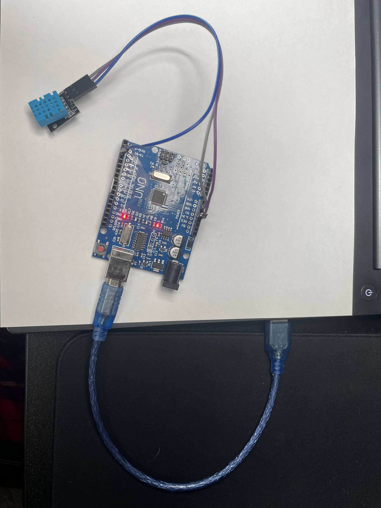

## Чтение данных
В качестве источника данных использован датчик DHT11 со встроенным резистором (версия с 3 пинами), pinout представлен на рисунке:

Код загруженный на arduino находится в файле dht11.ino
программа максимально простая, использует библиотеку "DHT sensor library" при помощи которой считывает данные с датчика. Далее данные выводятся через serial.

Собранная система представлена на рисунке:

Собранная система работает, вывод можно получить через serial.