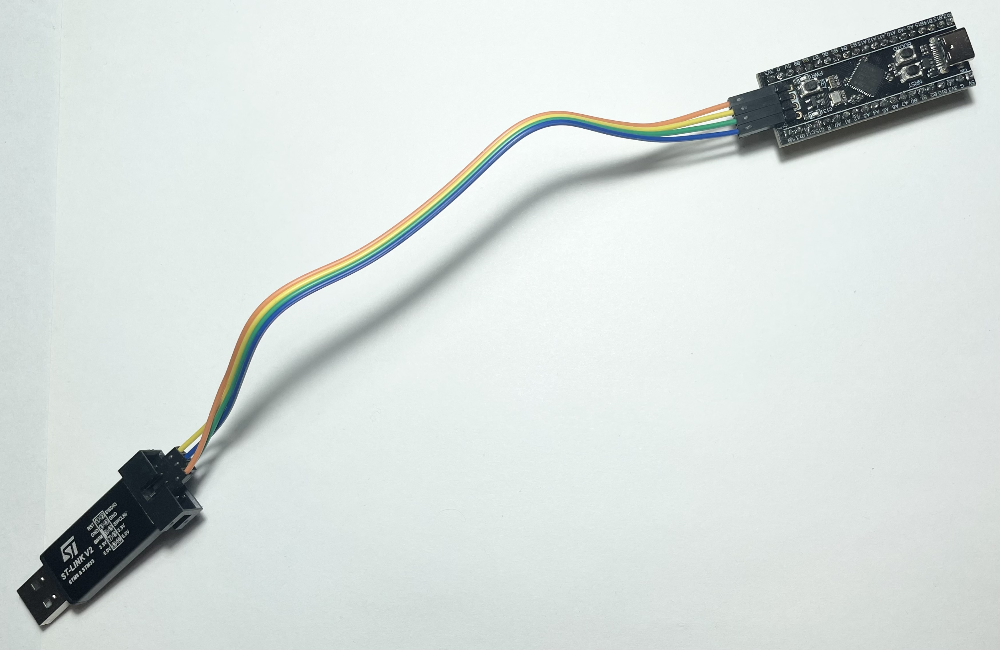
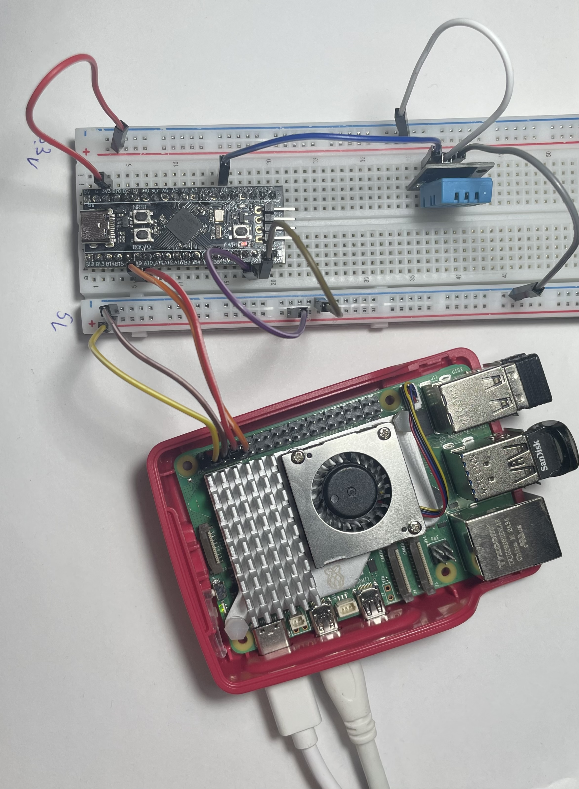
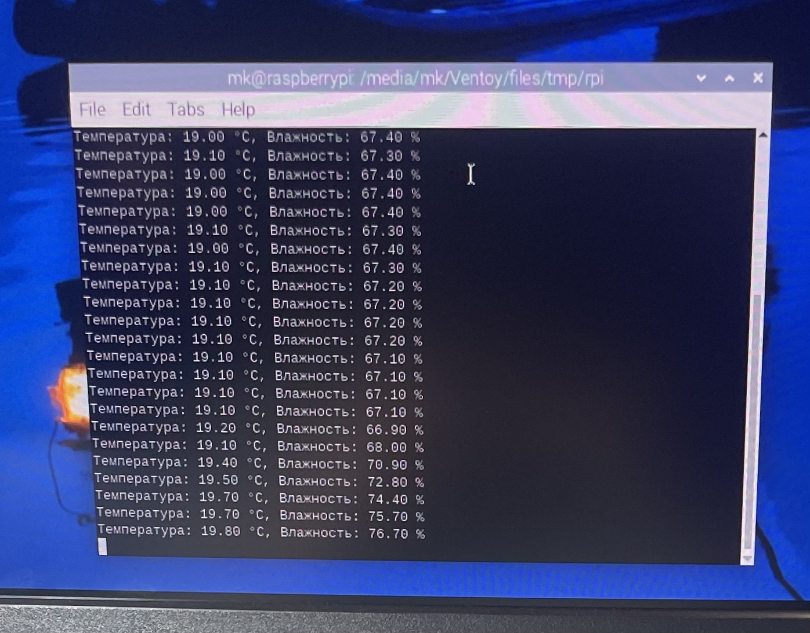

# Использование stm32 и gpio пинов raspberrypi

## Прошивка stm32

Написанная программа представленна в файле dht11_stm32.ino
Скетч компилировался через arduino-cli под плату STM32.
На выходе получен файл dht11_stm32.ino.hex.

Прошивка выполнялась через ST-Link V2 по интерфейсу SWD утилитой STM32CubeProgrammer. Подключённые программатор с микроконтроллером представленны на рисунке:

## Схема подключения

**Питание:**

| Raspberry Pi | STM32 Black Pill |
|---|---|
| 5V | 5V |
| GND | GND |

**UART (обе платы на 3.3V):**

| STM32 | Raspberry Pi |
|---|---|
| PA9 (TX) | GPIO 15 / RXD |
| PA10 (RX) | GPIO 14 / TXD |

**DHT11:**

| DHT11 | STM32 |
|---|---|
| VCC | 3V3 |
| GND | GND |
| DATA | PA0 |

Красная шина 5V - от Raspberry Pi, питает STM32.
Красная шина 3.3V - от пина 3V3 stm32, питает DHT11.
Синяя шина GND - общая земля.

Собранная схема представленна на рисунке:

## Чтение данных на Raspberry Pi

На Raspberry Pi запускался Python-скрипт, использующий библиотеку pyserial. Python скрипт расположен в файле read_stm32.py

Скрипт открывает UART-порт `/dev/ttyAMA0` и читает строки, приходящие от микроконтроллера.
STM32 отправляет данные в формате `T:23,H:45\r\n`, скрипт разбирает строку и выводит значения температуры и влажности в консоль каждые 2 секунды.

Вывод с raspberrypi представлен на рисунке:

