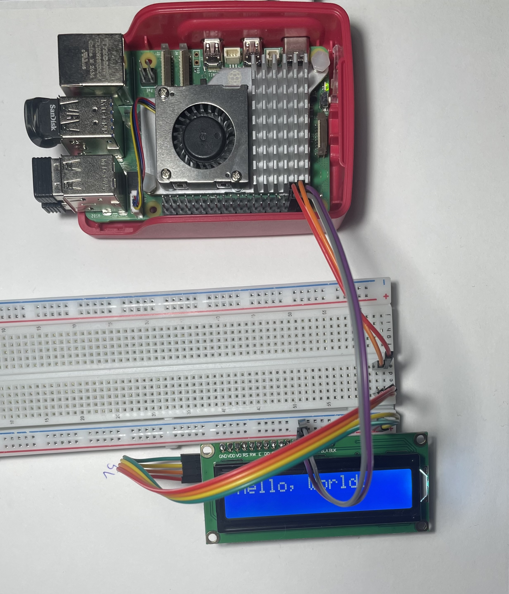
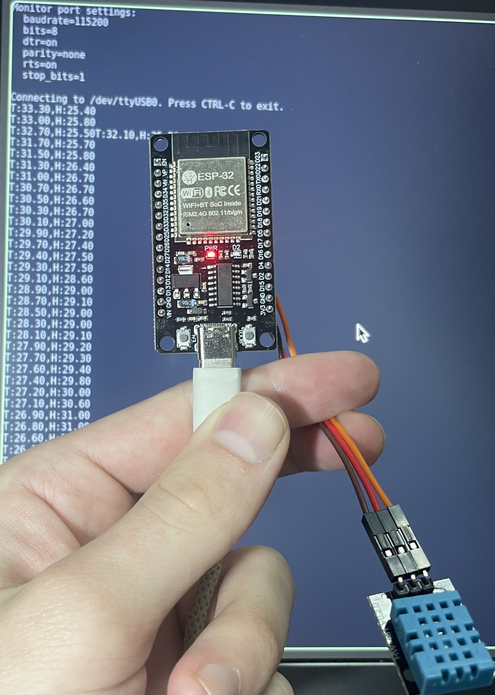
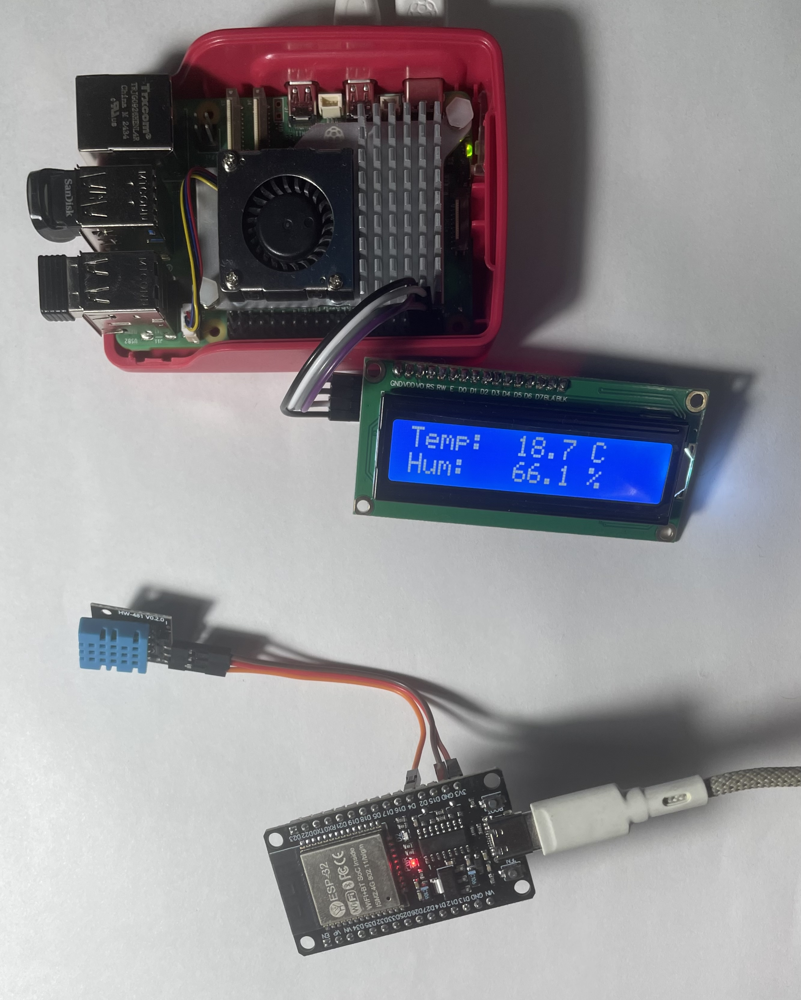

# Использование esp32 для передачи данных по wifi
## Тест принимающей стороны
raspberry pi будет принимать сигнал и выводить данные на lcd дисплей с i2c модулем. Для теста вывода и настройки lcd дисплея был написан простой скрип, представленный в файле lcd_test.py
На рисунке предсавлено тестирование данной связки.

PS это фото самого первого теста - вывода одной строки, а в скрипте тест вывода нескольих строк.

## Тест отправляющей стороны
Для проверки считывания данных с датчика при помощи esp32 был написан простой скетч выводящий считанные данные в serial. Скетч находится в файле esp32_dht.ino , результат его работы представлен на рисунке

## Передача данных
Для передачи данных использована точка доступа, создавамая esp32. Данные передаются при помощи tcp.
итоговые файлы с запущенным кодом - esp32_tcp.ino и read_wifi.py . Вся собранная система представлена на рисунке
