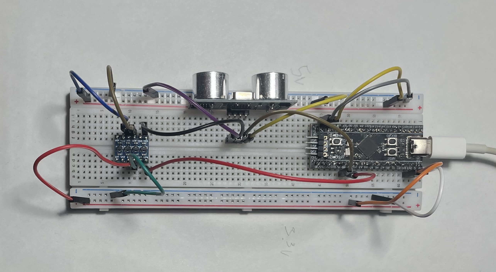
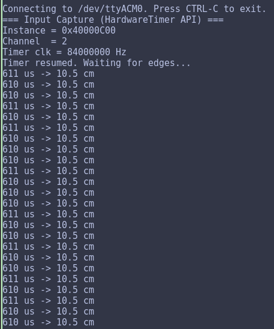
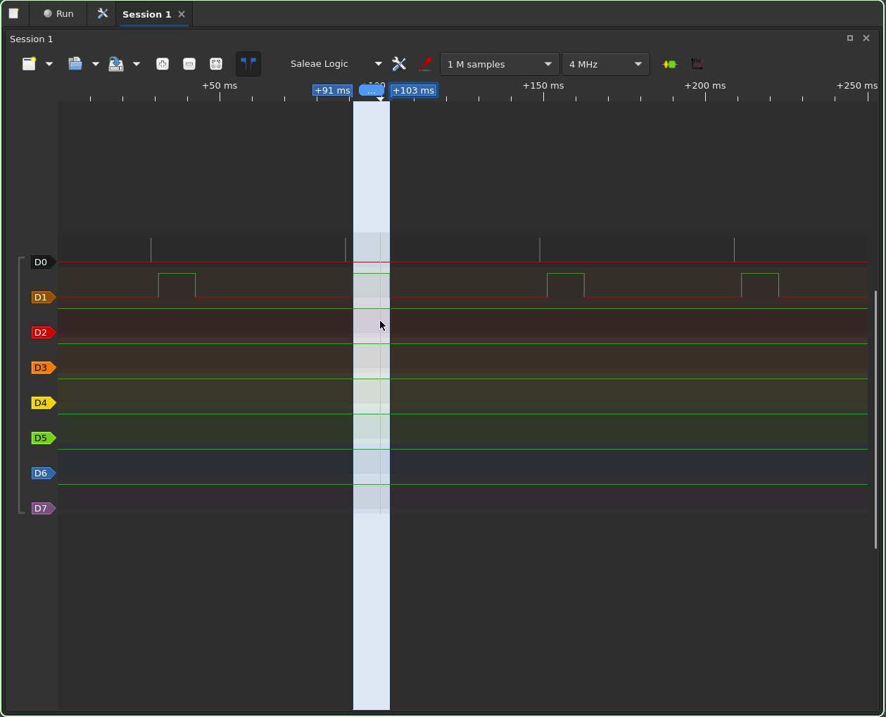

# Использование input capture для чтения данных с датчика

## Сборка схемы

Для измерения расстояния используется ультразвуковой дальномер HC-SR04. Датчик требует питания 5v, поэтому stm32 запитан через USB-C, а пин 5v платы используется для питания датчика. Линия ECHO проходит через преобразователь логических уровней, так как пин stm32 не толерантен к 5v.

На рисунке представлена собранная схема

## Особенности использования input capture

Для измерения длительности импульса ECHO используется таймер TIM2 в режиме input capture по обоим фронтам. Прескалер вычисляется динамически из частоты таймера, чтобы получить 1 тик = 1 мкс.

В ISR запоминается значение счётчика на переднем фронте, а на заднем вычисляется длительность импульса.

Итоговый файл - `inputCapture.ino`. Результат работы представлен на рисунке

## Отладка с помощью логического анализатора

На этапе отладки input capture не срабатывал - `ISR count` оставался нулевым, хотя сигнал на пин подавался. Для проверки гипотезы, что сигнал физически доходит до пина, использовался логический анализатор.

На диаграмме видны короткие импульсы на TRIG и длинные ответные импульсы на ECHO. Датчик работает корректно, и проблема была в настройке захвата со стороны stm32.
Вид окна pulseview при отладке показан на рисунке

## EXTI

В качестве запасного варианта был написан код на внешних прерываниях - файл `exti_test.ino`. Фронты ECHO ловятся через `attachInterrupt` с режимом `CHANGE`, время берётся из `micros()`, точности 1 мкс достаточно, так как 1 см расстояния соответствует 58 мкс импульса. 

Тест подтвердил работоспособность связки датчик-пин и дал стабильные измерения. После отказа от ручной настройки GPIO и перехода на автоматическое определение таймера input capture также заработал, и обе версии показали схожий результат.
